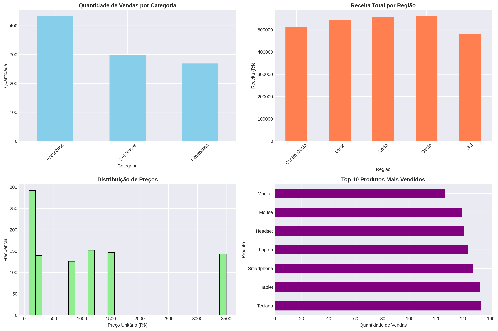
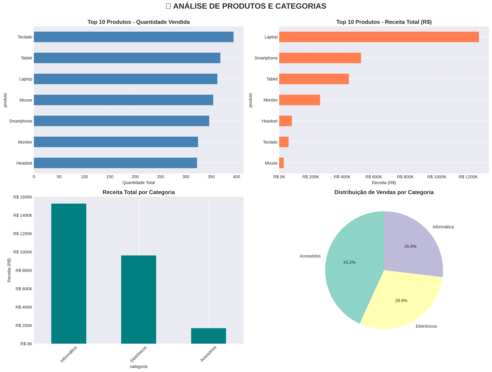
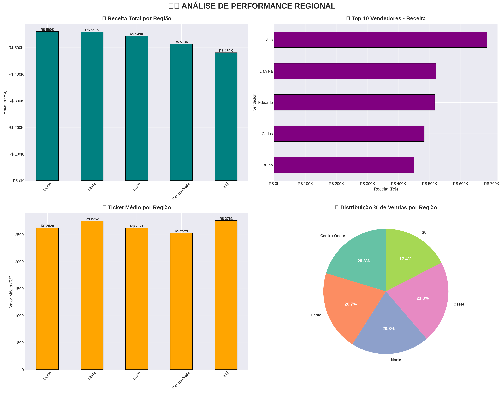
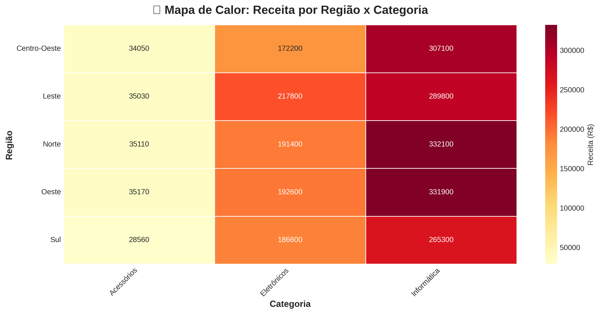
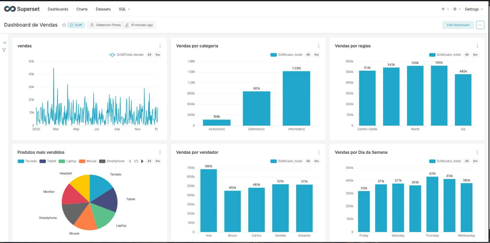

# 📊 Análise de Performance de Vendas — 2025

Este projeto realiza uma análise completa de dados de vendas utilizando **Python, SQL e visualização de dados**, com foco em geração de insights para apoio à tomada de decisão.

O projeto foi desenvolvido como parte do meu portfólio de **Análise de Dados**, simulando um cenário real de negócio.

---

## 🎯 Objetivo do Projeto

- Analisar o desempenho de vendas ao longo do tempo  
- Identificar padrões e tendências de faturamento  
- Aplicar conceitos de análise exploratória de dados (EDA)  
- Utilizar SQL para consultas analíticas  
- Criar visualizações claras e informativas  

---

## 🧰 Tecnologias Utilizadas

- Python 3
- Pandas
- Matplotlib / Seaborn
- SQL
- PostgreSQL
- Apache Superset
- Jupyter Notebook
- Git & GitHub
- Linux

---

## 📁 Estrutura do Projeto

- **data/**  
  Dados tratados e prontos para análise  

- **notebooks/**  
  Análises realizadas em Python  

- **sql/**  
  Scripts SQL e banco de dados  

- **images/**  
  Gráficos e visualizações geradas  

- **requirements.txt**  
  Dependências do projeto  

- **README.md**  
  Documentação do projeto

---

## 📊 Análises Realizadas

✔ Limpeza e tratamento dos dados  
✔ Análise de faturamento por período  
✔ Identificação de produtos e vendedores mais relevantes  
✔ Aplicação da Curva ABC  
✔ Análise de sazonalidade  
✔ Geração de gráficos para apoio à decisão  

---

## 📈 Visualizações

### 🔹 Exploração Inicial dos Dados

  

### 🔹 Ranking de Produtos

  

### 🔹 Análise Regional

  

### 🔹 Heatmap por Região e Categoria

  

## 📊 Dashboard Interativo — Apache Superset

Este dashboard foi desenvolvido utilizando **Apache Superset**, conectado a um banco de dados **PostgreSQL**, com o objetivo de visualizar e analisar dados de vendas de forma interativa.

### 🔹 Recursos do Dashboard
- Filtros por período, região, categoria e vendedor
- Visualização de métricas de vendas
- Análise comparativa entre regiões
- Gráficos interativos e dinâmicos

### 🔹 Tecnologias Utilizadas
- Apache Superset
- PostgreSQL
- SQL
- Linux

### 🔹 Print do Dashboard

  

📌 O dashboard foi construído a partir do arquivo `vendas_tratadas.csv`,
importado para o PostgreSQL e modelado no Apache Superset para criação das visualizações.

---

## 🧠 Principais Aprendizados

- Organização de projetos de dados
- Uso prático de SQL para análise
- Criação de gráficos orientados a negócio
- Estruturação de projetos de Data Analytics
- Visualização orientada à tomada de decisão

---

## 🚀 Próximos Passos

- Implementar novas métricas
- Criar dashboards mais avançados
- Automatizar análises
- Expandir o projeto com novos dados

---

📌 **Projeto desenvolvido para fins educacionais e portfólio profissional.**

